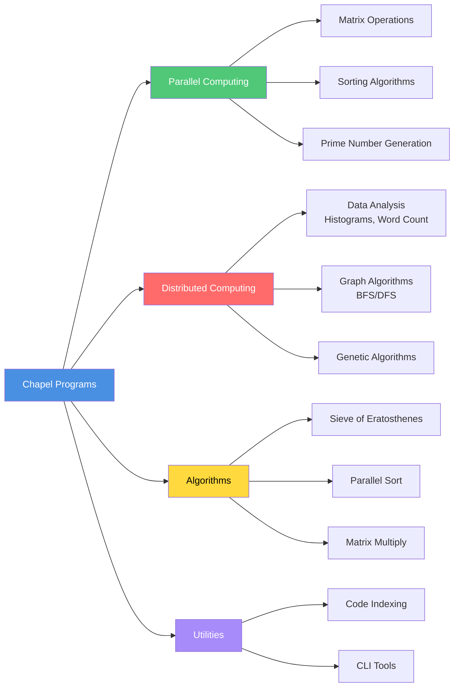
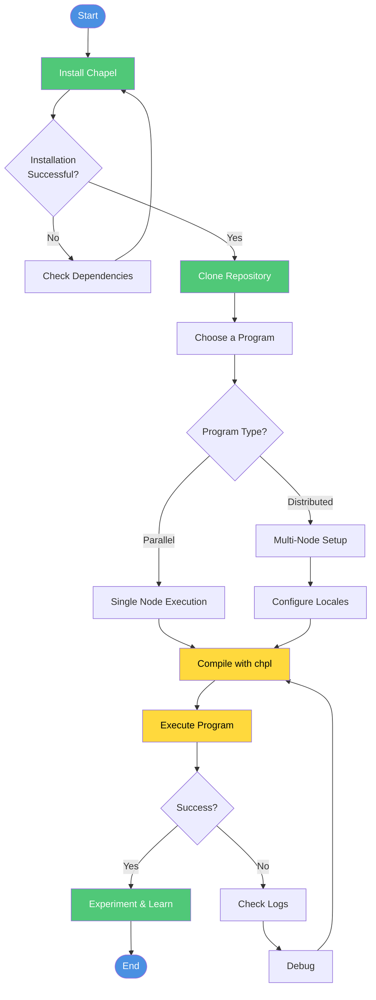
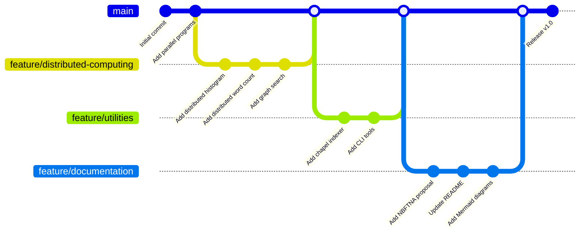
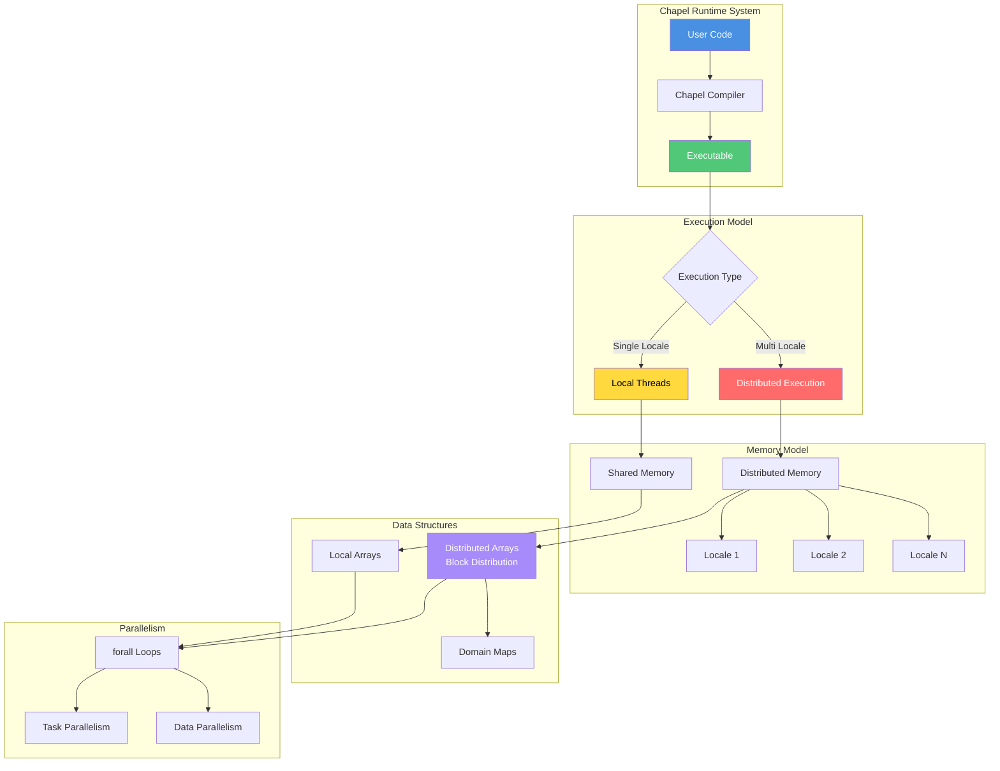
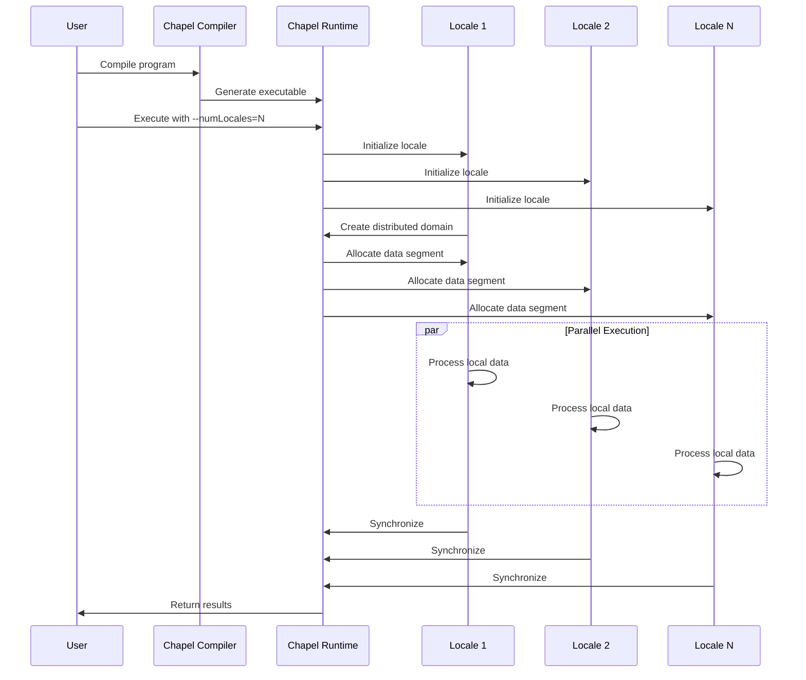
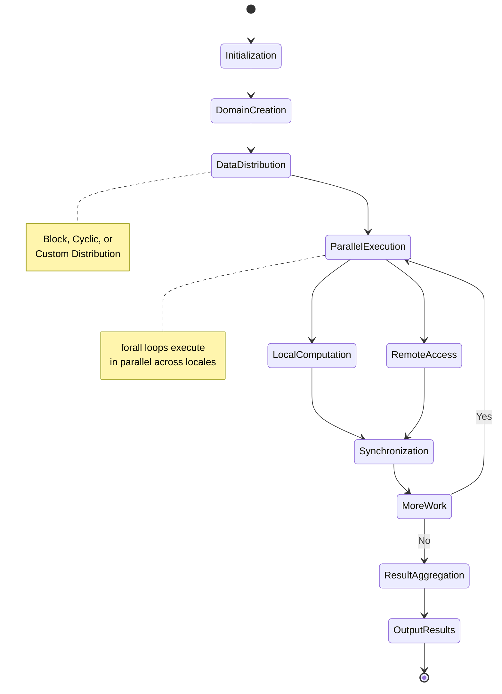
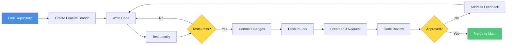

# Chapel_GPT

GPT-generated Chapel Language parallel and distributed computing programs demonstrating high-performance computing capabilities.

## Table of Contents
- [Overview](#overview)
- [Repository Structure](#repository-structure)
- [Program Categories](#program-categories)
- [Getting Started](#getting-started)
- [Git Workflow](#git-workflow)
- [Architecture](#architecture)
- [Installation](#installation)
- [Contributing](#contributing)

## Overview

This repository contains a collection of Chapel language programs that showcase:
- **Data Parallelism**: Trivially use cores across laptops, clusters, or supercomputers
- **Task Parallelism**: Create concurrency within a node or across systems
- **Distributed Arrays**: Leverage thousands of nodes' memories and cores
- **Global Namespace**: Direct access to local or remote variables
- **Python-like Syntax**: Easy-to-read, high-performance code

## Repository Structure

```mermaid
graph TD
    A[Chapel_GPT Repository] --> B[Parallel Programs]
    A --> C[Distributed Programs]
    A --> D[Utilities]
    A --> E[Documentation]
    A --> F[Installation Scripts]

    B --> B1[parallel_matrix_multiply.chpl]
    B --> B2[parallel_matrix_multiplyv2.chpl]
    B --> B3[parallel_primes.chpl]
    B --> B4[parallel_sorting.chpl]
    B --> B5[parallel_sorting_DEMO.chpl]

    C --> C1[distributed_histogram.chpl]
    C --> C2[distributed_histogramv2.chpl]
    C --> C3[distributed_word_count.chpl]
    C --> C4[distributed_word_countv2.chpl]
    C --> C5[distributed_graph_search.chpl]
    C --> C6[distributed_graph_searchv2.chpl]
    C --> C7[distributed_genetic_algorithm.chpl]

    D --> D1[chapel_indexer.chpl]
    D --> D2[chapel_indexer_CLI.chpl]

    E --> E1[NBFTNA_proposal.txt]
    E --> E2[TODO.txt]
    E --> E3[LICENSE]

    F --> F1[install/install_script_ubuntu.sh]

    style A fill:#4A90E2,color:#fff
    style B fill:#50C878,color:#fff
    style C fill:#FF6B6B,color:#fff
    style D fill:#FFD93D,color:#000
    style E fill:#A78BFA,color:#fff
    style F fill:#FCA5A5,color:#000
```



## Program Categories



## Getting Started



### Quick Start Commands

```bash
# 1. Install Chapel (Ubuntu)
cd install
chmod +x install_script_ubuntu.sh
./install_script_ubuntu.sh

# 2. Compile a parallel program
chpl parallel_sorting_DEMO.chpl -o sorting_demo

# 3. Run the program
./sorting_demo

# 4. For distributed execution (multi-locale)
chpl distributed_genetic_algorithm.chpl -o genetic_algo
./genetic_algo --numLocales=4
```

## Git Workflow



## Architecture



## Project Component Interaction



## Program Execution Flow



## Installation

### Prerequisites
- GCC 7.0 or later
- Python 3.6 or later
- LLVM 12 (recommended)
- At least 4GB RAM
- Linux, macOS, or WSL2 on Windows

### Ubuntu/Debian Installation

```bash
cd install
chmod +x install_script_ubuntu.sh
./install_script_ubuntu.sh
```

The installation script will:
1. Install required dependencies
2. Download Chapel 1.29.0
3. Compile and install Chapel
4. Configure environment variables

### Verify Installation

```bash
chpl --version
```

You should see output similar to:
```
chpl version 1.29.0
```

## Program Descriptions

### Parallel Programs

| Program | Description | Key Features |
|---------|-------------|--------------|
| `parallel_matrix_multiply.chpl` | Matrix multiplication using data parallelism | Distributed matrices, parallel computation |
| `parallel_primes.chpl` | Sieve of Eratosthenes for finding primes | Distributed sieve array, parallel algorithm |
| `parallel_sorting.chpl` | Parallel sorting algorithm | Block distribution, parallel sort |

### Distributed Programs

| Program | Description | Key Features |
|---------|-------------|--------------|
| `distributed_histogram.chpl` | Distributed histogram calculation | Remote data access, parallel aggregation |
| `distributed_word_count.chpl` | Parallel word counting | Distributed text processing |
| `distributed_graph_search.chpl` | BFS/DFS on distributed graphs | Task parallelism, distributed data structures |
| `distributed_genetic_algorithm.chpl` | Parallel genetic algorithm | Population distribution, periodic exchange |

### Utilities

| Program | Description | Key Features |
|---------|-------------|--------------|
| `chapel_indexer.chpl` | Code indexing utility | File processing |
| `chapel_indexer_CLI.chpl` | Command-line indexer | CLI interface |

## Contributing



### Contribution Guidelines

1. **Fork** the repository
2. **Create** a feature branch (`git checkout -b feature/amazing-feature`)
3. **Write** clean, documented code
4. **Test** your changes thoroughly
5. **Commit** with clear messages (`git commit -m 'Add amazing feature'`)
6. **Push** to your branch (`git push origin feature/amazing-feature`)
7. **Open** a Pull Request

## Documentation

- **NBFTNA_proposal.txt**: Proposal for non-blocking fat-tree network architecture using Chapel
- **TODO.txt**: List of planned programs and features
- **Chapel Documentation**: [https://chapel-lang.org/docs/](https://chapel-lang.org/docs/)

## License

This project is licensed under the terms specified in the LICENSE file.

## Resources

- [Chapel Language Official Site](https://chapel-lang.org/)
- [Chapel Documentation](https://chapel-lang.org/docs/)
- [Chapel GitHub Repository](https://github.com/chapel-lang/chapel)
- [Chapel Discourse Community](https://chapel.discourse.group/)

## Acknowledgments

Programs generated with assistance from GPT to demonstrate Chapel's powerful parallel and distributed computing capabilities.

---

**Note**: These programs are designed to run on systems ranging from single laptops to massive supercomputers with thousands of nodes. Adjust the `numLocales` configuration variable to match your available hardware.
