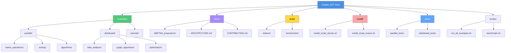

# Repository Structure Improvements

## Current State Analysis

The Chapel_GPT repository currently has all programs in the root directory, which works for a small collection but could benefit from better organization as it grows.

## Recommended Directory Structure

```
Chapel_GPT/
├── README.md
├── LICENSE
├── STRUCTURE_IMPROVEMENTS.md
│
├── docs/
│   ├── NBFTNA_proposal.txt
│   ├── TODO.txt
│   ├── ARCHITECTURE.md
│   └── CONTRIBUTING.md
│
├── examples/
│   ├── parallel/
│   │   ├── matrix_operations/
│   │   │   ├── parallel_matrix_multiply.chpl
│   │   │   └── parallel_matrix_multiplyv2.chpl
│   │   ├── sorting/
│   │   │   ├── parallel_sorting.chpl
│   │   │   └── parallel_sorting_DEMO.chpl
│   │   └── algorithms/
│   │       └── parallel_primes.chpl
│   │
│   ├── distributed/
│   │   ├── data_analysis/
│   │   │   ├── distributed_histogram.chpl
│   │   │   ├── distributed_histogramv2.chpl
│   │   │   ├── distributed_word_count.chpl
│   │   │   └── distributed_word_countv2.chpl
│   │   ├── graph_algorithms/
│   │   │   ├── distributed_graph_search.chpl
│   │   │   └── distributed_graph_searchv2.chpl
│   │   └── optimization/
│   │       └── distributed_genetic_algorithm.chpl
│   │
│   └── tutorials/
│       ├── 01_hello_parallel.chpl
│       ├── 02_distributed_arrays.chpl
│       └── 03_task_parallelism.chpl
│
├── tools/
│   ├── indexer/
│   │   ├── chapel_indexer.chpl
│   │   └── chapel_indexer_CLI.chpl
│   └── benchmarks/
│       └── performance_test.chpl
│
├── install/
│   ├── install_script_ubuntu.sh
│   ├── install_script_macos.sh
│   └── README_INSTALL.md
│
├── tests/
│   ├── parallel_tests/
│   │   └── test_parallel_sorting.chpl
│   └── distributed_tests/
│       └── test_distributed_histogram.chpl
│
└── scripts/
    ├── run_all_examples.sh
    ├── benchmark.sh
    └── setup_multi_locale.sh
```

## Benefits of Proposed Structure

### 1. Clear Categorization
- **examples/parallel/**: Single-node parallel programs
- **examples/distributed/**: Multi-node distributed programs
- **tools/**: Utility programs
- **docs/**: All documentation in one place

### 2. Scalability
- Easy to add new programs without cluttering root
- Subcategories allow grouping similar programs
- Room for growth (tutorials, benchmarks, etc.)

### 3. Professional Organization
- Follows industry best practices
- Makes repository navigation intuitive
- Easier onboarding for new contributors

### 4. Better Maintenance
- Easier to locate and update related programs
- Clear separation of concerns
- Simplified CI/CD integration

## Migration Strategy

### Phase 1: Create Directory Structure (Non-Breaking)
```bash
# Create new directories
mkdir -p examples/parallel/{matrix_operations,sorting,algorithms}
mkdir -p examples/distributed/{data_analysis,graph_algorithms,optimization}
mkdir -p examples/tutorials
mkdir -p tools/indexer
mkdir -p docs
mkdir -p tests/{parallel_tests,distributed_tests}
mkdir -p scripts
```

### Phase 2: Copy Files (Maintain Backwards Compatibility)
```bash
# Copy parallel programs
cp parallel_matrix_multiply*.chpl examples/parallel/matrix_operations/
cp parallel_sorting*.chpl examples/parallel/sorting/
cp parallel_primes.chpl examples/parallel/algorithms/

# Copy distributed programs
cp distributed_histogram*.chpl examples/distributed/data_analysis/
cp distributed_word_count*.chpl examples/distributed/data_analysis/
cp distributed_graph_search*.chpl examples/distributed/graph_algorithms/
cp distributed_genetic_algorithm.chpl examples/distributed/optimization/

# Copy tools
cp chapel_indexer*.chpl tools/indexer/

# Copy documentation
cp NBFTNA_proposal.txt docs/
cp TODO.txt docs/
```

### Phase 3: Add New Content
```bash
# Create README files for each directory
echo "# Parallel Examples" > examples/parallel/README.md
echo "# Distributed Examples" > examples/distributed/README.md
echo "# Tools and Utilities" > tools/README.md

# Add tutorial programs
# Add test cases
# Add convenience scripts
```

### Phase 4: Deprecation (Optional)
After ensuring all links and references are updated:
```bash
# Move original files to deprecated directory
mkdir deprecated
mv parallel_*.chpl deprecated/
mv distributed_*.chpl deprecated/
mv chapel_indexer*.chpl deprecated/
```

## Mermaid Diagram: Proposed Structure



## Implementation Priority

### High Priority
1. ✅ Enhanced README with Mermaid diagrams
2. Create `docs/` directory and move documentation
3. Create `examples/` with subcategories
4. Add directory-specific README files

### Medium Priority
1. Create `scripts/` for automation
2. Add `tests/` directory with sample tests
3. Expand `install/` with platform-specific scripts
4. Create tutorial programs

### Low Priority
1. Add CI/CD configuration
2. Create benchmarking framework
3. Add performance comparison tools
4. Develop comprehensive test suite

## File Naming Conventions

### Current Convention
- Programs use descriptive names with underscores
- Version numbers appended (e.g., `v2`)

### Recommended Enhancements
```
# Good - Clear, descriptive, follows pattern
parallel_matrix_multiply.chpl
distributed_genetic_algorithm.chpl

# Better - Include category prefix for discoverability
matrix_multiply_parallel.chpl
genetic_algorithm_distributed.chpl

# Best - Within categorized directories, simpler names
examples/parallel/matrix_operations/multiply.chpl
examples/distributed/optimization/genetic_algorithm.chpl
```

## Documentation Standards

### Each Directory Should Contain
1. **README.md**: Overview and usage instructions
2. **Examples**: Sample code snippets
3. **Requirements**: Dependencies and prerequisites
4. **References**: Links to relevant documentation

### Example Directory README Template
```markdown
# [Category Name]

## Overview
Brief description of programs in this category.

## Programs
- `program1.chpl`: Description
- `program2.chpl`: Description

## Usage
```bash
chpl program1.chpl -o program1
./program1 --option=value
```

## Prerequisites
- Chapel version: X.Y.Z
- Required modules: ...
- Hardware requirements: ...

## See Also
- Related programs
- Documentation links
```

## Automated Organization Script

```bash
#!/bin/bash
# organize_repository.sh

echo "Creating directory structure..."
mkdir -p examples/parallel/{matrix_operations,sorting,algorithms}
mkdir -p examples/distributed/{data_analysis,graph_algorithms,optimization}
mkdir -p docs tools/indexer scripts tests

echo "Moving parallel programs..."
for file in parallel_*.chpl; do
    case "$file" in
        *matrix*)
            cp "$file" examples/parallel/matrix_operations/
            ;;
        *sorting*)
            cp "$file" examples/parallel/sorting/
            ;;
        *primes*)
            cp "$file" examples/parallel/algorithms/
            ;;
    esac
done

echo "Moving distributed programs..."
for file in distributed_*.chpl; do
    case "$file" in
        *histogram*|*word_count*)
            cp "$file" examples/distributed/data_analysis/
            ;;
        *graph*)
            cp "$file" examples/distributed/graph_algorithms/
            ;;
        *genetic*)
            cp "$file" examples/distributed/optimization/
            ;;
    esac
done

echo "Moving documentation..."
mv NBFTNA_proposal.txt docs/
mv TODO.txt docs/

echo "Moving tools..."
cp chapel_indexer*.chpl tools/indexer/

echo "Organization complete!"
```

## Next Steps

1. **Review**: Team reviews this proposal
2. **Approve**: Get consensus on structure
3. **Implement**: Execute Phase 1 and 2
4. **Document**: Update all references
5. **Communicate**: Inform users of changes
6. **Monitor**: Ensure smooth transition

## Backwards Compatibility

During transition:
- Keep original files in root with deprecation notice
- Update all internal references
- Provide migration guide for users
- Maintain both structures for one release cycle

## Metrics for Success

- Reduced time to find specific programs
- Increased contributor engagement
- Better code organization scores
- Positive user feedback
- Easier CI/CD integration

---

**Note**: This is a living document. As the repository evolves, this structure should be reviewed and updated to meet changing needs.
